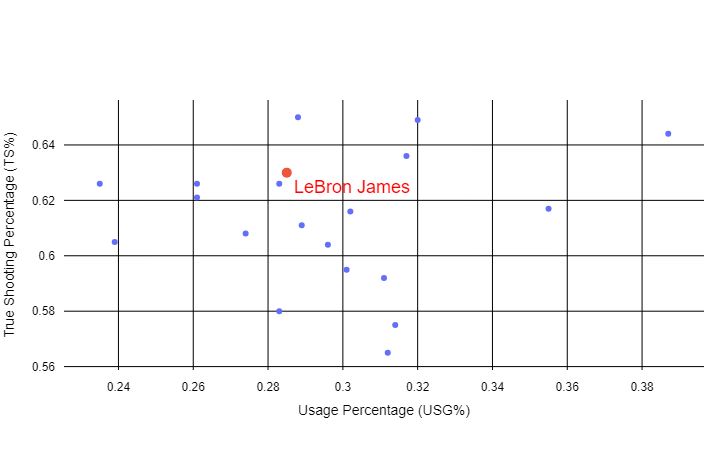

# Data Visualisation for DunkHebdo.fr


## Summary

DunkHebdo is a French podcast dedicated to the NBA, providing news and insights to the French basketball community. Every year, they release their "DH20," a Top 20 ranking of NBA players. To create this ranking, they invite the community to submit their votes, which are then combined with the editorial team's votes to form the final "DH20".

This project aims to provide data analysis of the community's DH20 through a Streamlit app : https://dh20-2324.streamlit.app/

## Data sources

The data sources are both the voting responses collected in Excel files and NBA statistics retrieved via an API client for nba.com. See https://github.com/swar/nba_api.

## Contents

### 1.   Extract, Transform and Load data

The etl.py file is designed to extract data from the NBA API client, perform the necessary transformations, and load it into .csv files.

Here is an example of how to use the nba.api client :

```python
import pandas as pd
from nba_api.stats.endpoints import leaguedashplayerstats

stats = leaguedashplayerstats.LeagueDashPlayerStats(
    season="2023-24",
    season_type_all_star="Regular Season",
    per_mode_detailed="PerGame",
    measure_type_detailed_defense="Base"
    )
df = stats.get_data_frames()[0]
```


### 2.   Community Votes Visualisation

The first Streamlit page provides the user with the distribution of votes for a player. See the example for Bam Adebayo.


### 3.   NBA stats visualisations for the players in the DH20

The second page shows several stat visualizations for the player and his ranking for each stat within the DH20.

For example, there is a visualization of the efficiency ranking:



## Packages

https://matplotlib.org/3.5.3/api/_as_gen/matplotlib.pyplot.html

https://seaborn.pydata.org/

https://plotly.com/python/graph-objects/

